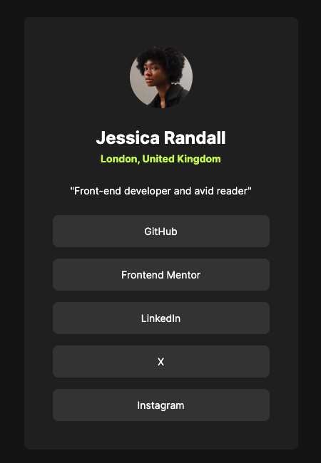

# Frontend Mentor - Social links profile solution

This is a solution to the [Social links profile challenge on Frontend Mentor](https://www.frontendmentor.io/challenges/social-links-profile-UG32l9m6dQ). Frontend Mentor challenges help you improve your coding skills by building realistic projects. 

## Table of contents

- [Overview](#overveiw)
  - [The challenge](#the-challenge)
  - [Screenshot](#screenshot)
  - [Links](#links)
- [My process](#my-process)
  - [Built with](#built-with)
- [Author](#author)
- [Acknowledgments](#acknowledgments)

## Overview

### The challenge

Users should be able to:

- See hover and focus states for all interactive elements on the page

### Screenshot

### Liks

- Solution URL: [GitHub repository](https://github.com/josip-h/social-links-profile)
- Live Site URL: [GitHub Pages](https://josip-h.github.io/social-links-profile/)

## My process

### Built with

- Semantic HTML5 markup
- CSS
- Flexbox
- Mobile-first workflow
- GitHub Pages

## Author

- Website - [Josip Hanzevacki](https://github.com/josip-h)
- Frontend Mentor - [@josip-h](https://www.frontendmentor.io/profile/josip-h)